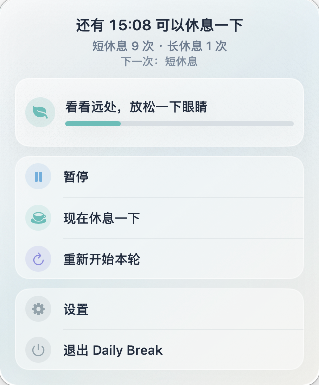
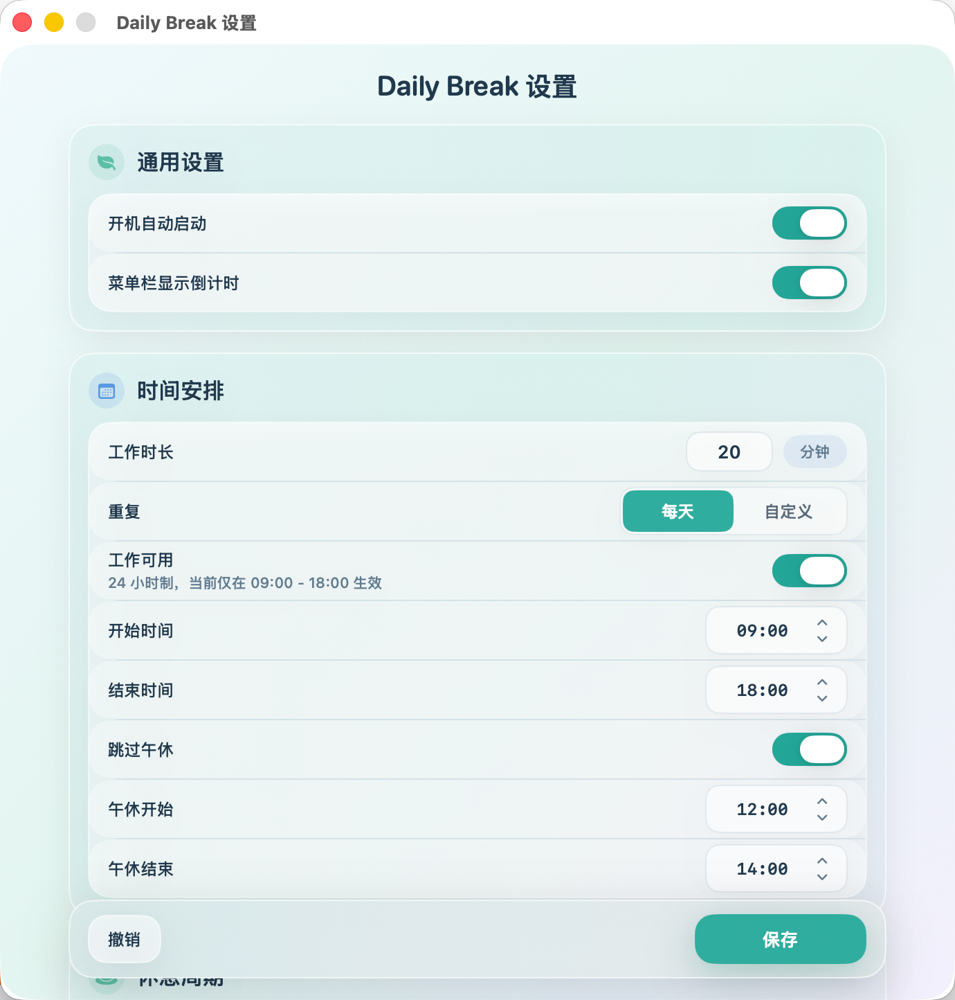
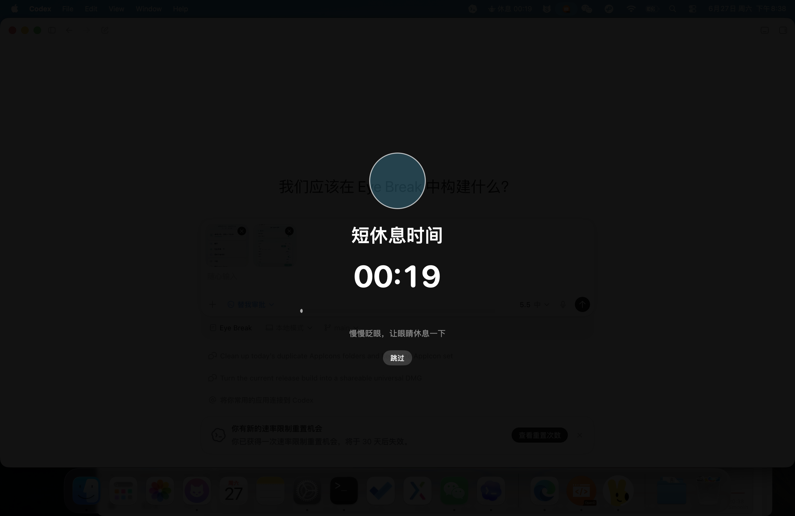

# Eye Break 👁️

一个 macOS 菜单栏应用，定时提醒你休息眼睛，远离屏幕疲劳。

## 应用预览

| 菜单栏控制面板 | 设置界面 |
| --- | --- |
|  |  |

### 全屏休息提醒



## 适用场景

专为长时间面对电脑的**办公/工作场景**设计。按照设定的工作周期，自动弹出全屏休息界面，强制你离开屏幕放松眼睛。

## 功能特性

- 🕐 **定时提醒** — 可配置工作时长，倒计时结束后自动进入休息模式
- 🔄 **短休息 / 长休息** — 支持短休息和长休息交替，长休息间隔可自定义
- 🌙 **午休跳过** — 可设置午休时段，期间暂停提醒
- 📅 **活跃日期** — 支持每天或自定义工作日生效
- ⏰ **活跃时段** — 可限制提醒只在指定时间段内触发
- 🎨 **全屏蒙层** — 休息时覆盖所有屏幕，三档强度可调
- 💡 **休息前轻提示** — 休息前 30 秒在屏幕右下角显示呼吸浮层提醒
- 🟡 **投影自动暂停** — 检测到投影/外接显示时自动暂停，退出后自动继续，并在状态栏标黄
- 💤 **系统感知** — 锁屏、睡眠期间自动暂停，唤醒后恢复
- 🚀 **开机自启** — 可配置登录时自动启动
- 📊 **菜单栏倒计时** — 菜单栏图标显示距离下次休息的剩余时间

## 系统要求

- macOS 13.5 或更高版本
- Apple Silicon (arm64) / Intel (x86_64) 通用二进制

## 安装说明

由于应用未经过 Apple 官方签名公证，首次打开时需要进行以下操作：

1. 下载 `.dmg` 文件并拖入 `Applications` 文件夹
2. 打开 **系统设置 → 隐私与安全性**
3. 在安全性部分，找到被阻止的 "Eye Break" 并点击 **"仍要打开"**
4. 或通过终端运行：
   ```bash
   sudo xattr -dr com.apple.quarantine "/Applications/Eye Break.app"
   ```

## 使用方式

- 应用启动后，菜单栏会出现 👁 图标
- 点击图标弹出控制面板，可查看状态、暂停/恢复、立即休息
- 设置面板中配置工作时长、休息周期、活跃时段等参数
- 倒计时归零时自动进入全屏休息界面

## 技术架构

- SwiftUI + AppKit 混合架构
- 纯状态机驱动的计时引擎（`BreakTimerEngine`）
- UserDefaults 持久化存储
- 测试覆盖：23 个确定性单元测试（时间注入，无需真实时钟）

## 版本更新

### v1.1.0

- 新增休息前 30 秒屏幕右下角呼吸浮层提示，替代系统通知提醒
- 移除本地通知权限申请和系统通知发送
- 新增投影/外接显示检测：投影中自动暂停计时，状态栏显示黄色，退出投影后自动继续
- 优化临近休息浮层尺寸、透明区域和布局刷新逻辑，避免浮层放大时超出显示区域

## 开发

```bash
# 构建
xcodebuild -project "Eye Break.xcodeproj" -scheme "Eye Break" -configuration Debug build

# 测试
xcodebuild -project "Eye Break.xcodeproj" -scheme "Eye Break" -configuration Debug test

# 打包 DMG
bash scripts/package_dmg.sh
```
